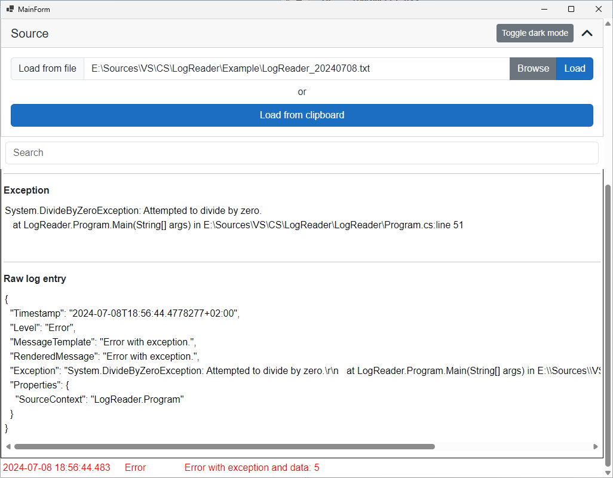

# LogReader

* Log reader is a very simple `WebView.WindowsForms` application.
* After loading the log file it will display it in a human readable form.
* You can expand entries to show the full log message and some additional info.
  * Expanded entries are marked with a thin black border.
  * `Exception` is only shown when it has value. (it can be closed by clicking its header). It is a `<textarea>`, so it can be edited, which is not stored, you can reload it by closing and opening the section.
  * `Raw log entry` is default closed, can be shown by clicking its header. It is a `<textarea>`, so it can be edited, which is not stored, you can reload it by closing and opening the section.




## Supported log formats

### JSON

Normal JSON output format, where the property names are not truncated (e.g. `Serilog.Formatting.Json`). Each line contains one whole JSON entry that holds the log information.

```json
{
  "Timestamp": "2024-07-08T18:56:44.4421943+02:00",
  "Level": "Verbose",
  "MessageTemplate": "Trace.",
  "RenderedMessage": "Trace.",
  "Properties": {
    "SourceContext": "LogReader.Program"
  }
}
```

### Compact JSON

Compact JSON output format, where the property names are truncated (e.g. `Serilog.Formatting.Compact`). Each line contains one whole JSON entry that holds the log information.

```json
{
  "@t": "2016-06-07T03:44:57.8532799Z",
  "@m": "Hello, \"nblumhardt\"",
  "@i": "7a8b9c0d",
  "User": "nblumhardt"
}
```

## Search

* The search input is split to tokens on each space. Everything is case-insensitive.
* If you want to search for a text with space in it, you have to place it in double quite, e.g. `"test string"`.
* Each token must match the given entry to display it (so they are connected with `AND` logical operators).
* Search is triggered only `onchange` event, meaning you have to press enter or focus something else in the software.
* Anything that is not a special token will be matched against `Level`, `RenderedMessage` and `Exception` as `Contains`.


### Special tokens

You can use the following operators to filter for `Timestamp` or `Level` (case-insensitive):

* `<`: `Timestamp` or `Level` must be smaller than the given value.
* `<=`: `Timestamp` or `Level` must be smaller than or equal to the given value.
* `>`: `Timestamp` or `Level` must be bigger than the given value.
* `>=`: `Timestamp` or `Level` must be bigger than or equal to the given value.
* `==`: `Timestamp` or `Level` must be equal to the given value.
* `!=`: `Timestamp` or `Level` must be not equal to the given value.

#### Supported log levels

* `Verbose`/`Trace` level:
  * `verb`
  * `verbose`
  * `trace`
* `Debug` level:
  * `deb`
  * `debug`
* `Information` level:
  * `inf`
  * `info`
  * `information`
* `Warning` level:
  * `warn`
  * `warning`
* `Error` level:
  * `err`
  * `error`
* `Fatal`/`Critical` level:
  * `fatal`
  * `crit`
  * `critical`

##### Examples

`>=deb`

`<info`

`==fatal`

#### Supported date formats

Anything that can be parsed by `DateTime.Parse`. Don't forget to use double quotes (`"`) if you want to place spaces between date and time.
Note that if you only use time it will parse it as the current date + the given time, not any date.

##### Examples

`>=19:30`

`"<2024-07-23 10:30:00"`
